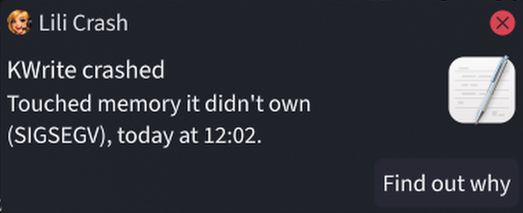
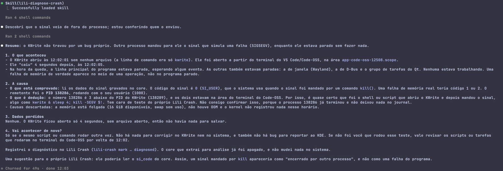
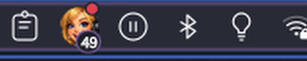
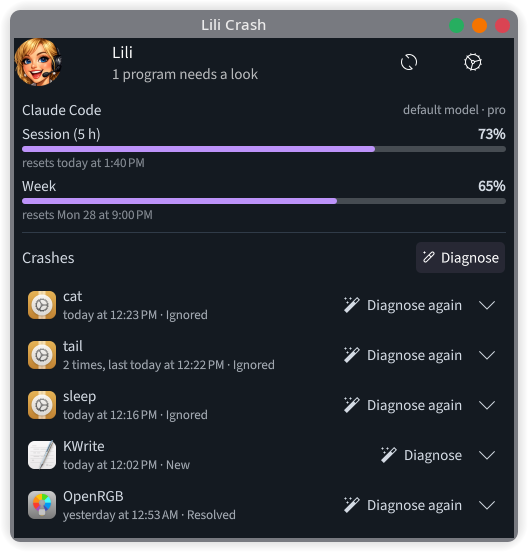
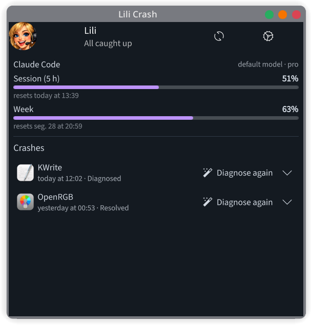
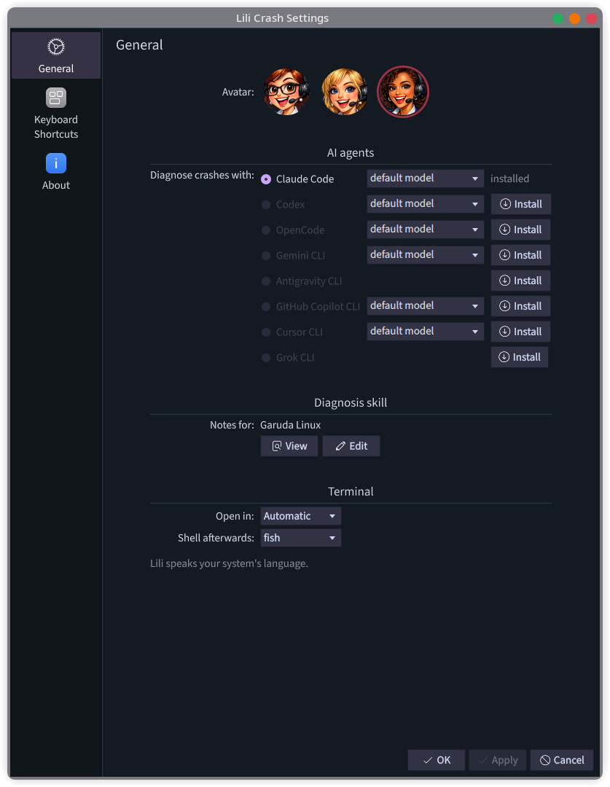

<p align="center"></p>

<h1 align="center">Lili Crash</h1>

<p align="center"><b>When a program on your Linux computer closes by itself, Lili tells you why, in plain words.</b></p>

---

## The problem

You're working, and a program just vanishes. No message, no explanation. Maybe it was
a bug, maybe your computer ran out of memory, maybe an update broke something. Finding
out usually means digging through logs and cryptic reports that only experts can read.

## What Lili does

Lili watches for programs that crash. When one does, she lets you know, and with a
single click she asks an AI assistant (like Claude or ChatGPT's Codex) to investigate
for you and explain what happened, whether you lost anything, and whether it will
happen again.

She also notices when the **whole computer froze** (black screen, nothing responds,
you had to hold the power button). Nobody can see a warning while that's happening,
so the next time you log in, Lili tells you what was going on right before it: the
graphics driver stopped responding, the kernel got stuck, memory ran out, or nothing
was logged at all. One click and the AI reads what happened on that boot.

And she keeps an eye on **Steam games**. A game that closes by itself less than two
minutes after you started it, usually after a message like "couldn't connect to
Steam", leaves no crash record, only Steam's own logs. Lili notices, tells you which
Proton it ran with, and hands the AI the lines Steam logged in that window.

You don't need to know anything about Linux to use her.

## How it works, step by step

### 1. A program crashes, and Lili tells you

A message pops up in the corner of your screen with the name of the program that
closed, and a simple description of what went wrong.

<p align="center"></p>

### 2. You click "Find out why"

A window opens and the AI starts investigating on its own. It reads the technical
records the computer kept at the moment of the crash, checks whether the computer was
out of memory, looks at recent updates, and then writes you a report: **what
happened, what caused it, whether any of your work was lost, and whether it will
happen again.**

It answers in your language. In the example below it found out that this "crash" was
actually caused on purpose, by a test, and even suggested an improvement to Lili
herself, offering to open an issue for it.

<p align="center"></p>

The AI only looks. It never changes anything on your computer without asking you
first.

### 3. Lili lives next to your clock

Lili sits in the corner of your taskbar, next to the Wi-Fi and the volume.

<p align="center"></p>

- The **number** is how much of your AI plan you've used in the current session (AI
  plans have limits). It turns **orange** at 80% and **red** at 95%, so you're never
  caught by surprise.
- The **red dot** means a program crashed and nobody has looked at it yet.
- Move the mouse over her to see the details.

### 4. Click her to see everything

**Your AI usage**, and **every program that crashed**, with what's still pending.
When something needs a look, one button handles it.

<p align="center">

&nbsp;

</p>

<p align="center"><i>Left: KWrite just crashed (New). Right: after the diagnosis (Diagnosed).</i></p>

Each program shows its state:

| State | Meaning |
|---|---|
| **New** | It crashed and nobody looked yet |
| **Diagnosed** | The AI explained it; the cause is saved, one sentence, right there |
| **Resolved** | You fixed it |
| **Ignored** | You don't care about this one; Lili stops telling you about it |

If the program crashes again later, it goes back to **New** on its own.

### 5. Make her yours

Right-click Lili and pick *Configure*.

<p align="center"></p>

- **Pick your Lili.** Three looks; the one you choose shows up everywhere.
- **Pick your AI.** Claude Code, Codex, OpenCode, Gemini CLI, Antigravity CLI, GitHub
  Copilot CLI, Cursor CLI or Grok CLI. Don't have one? The **Install** button next to
  it runs the official installer for you, no password needed.
- **Pick the model**, if your AI offers more than one.
- **Your Linux, your notes.** Lili knows where each Linux flavour keeps its records
  (Arch, Garuda, Debian, Ubuntu, Fedora, openSUSE and more). You can read those notes
  and even edit them.
- **Pick the terminal** the AI opens in.

## Install

Open a terminal and paste:

```bash
git clone https://github.com/cryptoconspiracy/lili-crash.git
cd lili-crash
./install.sh
```

The installer recognizes your Linux and checks what's missing. If something is (for
example `systemd-coredump` on Ubuntu and Debian), it tells you exactly which packages
and asks before installing them; that's the only moment it may ask for your password.
Everything else stays in your own folder.

That's all. Lili appears next to your clock right away, and from then on she starts
by herself every time you log in: nothing to open, nothing to remember. You can also
type **Lili** in your application menu to open her panel as a window.

You'll also need an account with one of the AI assistants above (for example a
Claude or ChatGPT subscription).

### Updating

In the folder you cloned:

```bash
git pull
./install.sh
```

The notifications update right away. Lili's panel next to the clock is loaded when
you log in, so if it doesn't show what's new, log out and back in.

## Will it work on my computer?

### Your Linux

Lili works on any Linux that uses **systemd**, which is almost all of the popular ones.
For each family below she knows where that Linux keeps its records, so the AI starts
its investigation in the right place.

| Linux | Works | Good to know |
|---|---|---|
| **Garuda Linux** | ✅ Tested | Where Lili was built. Knows about its snapshots, so the AI can tell you which update came right before a crash |
| **Arch Linux**, **Manjaro**, **EndeavourOS**, **CachyOS** | ✅ | Uses the Arch notes |
| **Fedora** (Workstation, KDE), **Nobara**, **Rocky Linux**, **AlmaLinux** | ✅ | Uses the Fedora notes |
| **Bazzite**, **Fedora Silverblue / Kinoite**, **Aurora**, **Bluefin** | ✅ | Has its own notes: these systems update as a whole image, so the AI compares images with `rpm-ostree` instead of reading a package history |
| **openSUSE** Tumbleweed, Leap, Slowroll | ✅ | Uses the openSUSE notes, snapshots included |
| **Ubuntu**, **Kubuntu**, **Linux Mint**, **Pop!_OS**, **KDE neon**, **Zorin OS**, **elementary OS** | ✅ | Uses the Ubuntu notes. Ubuntu hands crashes to its own tool, Apport; the installer adds `systemd-coredump` so Lili sees them too (the two live together since Ubuntu 24.04) |
| **Debian** | ✅ | Uses the Debian notes. The installer adds `systemd-coredump`, which Debian leaves out |
| **NixOS**, **Solus** and other systemd distributions | ✅ | Uses the general notes; the AI works out the rest |
| **Void**, **Alpine**, **Artix**, **Devuan**, **Gentoo with OpenRC**, **antiX**, **MX Linux** (default setup) | ❌ | No systemd, so there's no crash record for Lili to read |

Only Garuda has been tried so far. If you run Lili on another one, an issue telling us
how it went is very welcome, and so are notes for a Linux that isn't listed
(`skill/lili-diagnose-crash/distros/`).

### Your desktop

| | |
|---|---|
| **KDE Plasma 6** | Everything: notifications, Lili next to the clock, settings |
| **GNOME, XFCE, Cinnamon and others** | Crash notifications and the diagnosis. Lili's icon next to the clock is KDE only for now |
| **Wayland or X11** | Either one |

## Privacy, honestly

- When a program crashes, the computer saves a copy of what that program had in
  memory. That copy can contain passwords or documents. When you click *Find out why*,
  the AI reads it, and what the AI reads goes to the company behind it (Anthropic,
  OpenAI, Google...). **If the program that crashed was handling something private,
  don't click.**
- To show your usage, Lili asks Claude and Codex for your numbers the same way their
  own apps do, with the login they already saved. It doesn't send anything anywhere
  else.
- Lili tells the AI to look and never touch. What the AI is allowed to do without
  asking is set in that AI's own settings.

## Language

Lili speaks your system's language. Today she knows English and Brazilian
Portuguese; translations live in `po/` and are very welcome.

If your system is set to a language that was never installed (`locale -a` doesn't list
it), Linux quietly falls back to English everywhere, Lili included. Your distribution's
`locale-gen` fixes that.

---

## For the curious: the command line

Everything Lili does is also a command:

| Command | What it does |
|---|---|
| `lili-crash list` | Programs that crashed, newest first, as JSON |
| `lili-crash diagnose <pid\|boot\|steam-id>...` | Open the AI on one or more crashes, freezes or Steam games that closed early |
| `lili-crash mark <binary> <state> [summary]` | Set a program to `new`, `diagnosed`, `resolved` or `ignored` |
| `lili-crash notify <pid\|boot\|steam-id>` | Show the notification for one of them |
| `lili-crash watch` | Notify every new crash, every Steam game that closes within two minutes, and a freeze from the boot before (the `lili-crash` user service runs this) |
| `lili-crash install <agent>` | Run an AI's official installer in a terminal |
| `lili-crash skill <path\|view\|edit\|reset>` | The notes for your distribution |
| `lili-crash config [set <key> <value>]` | Settings shared with the tray icon |

`coredumpctl list` shows the PIDs. A freeze is known by its boot id (`journalctl --list-boots`),
and its state lives under the name `freeze`. Lili counts a boot as frozen when it ended
without the "System is rebooting / powering down" that a normal shutdown logs.

A Steam game is known by `steam-<appid>-<start>` and its state lives under
`steam:<appid>`. Lili reads the runs from Steam's `logs/content_log.txt` (native,
`~/.steam/steam` or the Flatpak), so the history lasts as long as Steam keeps that log.

To check the installer on other distributions, `tests/install-in-containers.sh` runs it
in clean Ubuntu, Debian, Fedora, openSUSE and Arch containers (needs podman).

## What's new

### Next: Steam games that close by themselves

A game that gives up right after starting (Proton can't reach Steam, a launcher
fails) exits cleanly, so there was no crash for Lili to see. Now a Steam game that
stops less than two minutes after it started counts: the notification says how long
it lasted and which Proton ran it, and *Find out why* gives the AI the launch command
and what Steam logged in that window. Ignoring a game works the same as ignoring a
program.

### 0.3: when the whole computer freezes

Sometimes it isn't one program: the screen goes black, nothing responds, and the only
way out is holding the power button. There's no crash record for that, so Lili used
to miss it. Now she doesn't.

- The next time you log in, she tells you the computer froze and what was going on
  right before it: the graphics driver (NVIDIA, AMD or Intel) stopped responding, the
  kernel got stuck, memory ran out, or nothing was logged at all.
- *Find out why* hands the AI the boot that froze, with the first warning signs
  already picked out, and the AI knows how to read it: the first thing that went
  wrong rather than the loudest, which program was caught in the driver, and what
  NVIDIA's error codes mean.
- Freezes show up in her list as **The computer froze**, with the same New,
  Diagnosed, Resolved and Ignored states as programs.

Lili counts a boot as frozen when it ended without the "rebooting / powering down"
message a normal shutdown leaves behind.

### 0.2: first release

Crash notifications, a one-click diagnosis with eight AI assistants, notes for each
Linux family, and Lili next to your clock with your AI usage.

## What's next

- Telling a real crash apart from a program that was closed on purpose by another one
  (the AI already spots it, as in the picture above; the notification should too).
- Muting a program that crashes all the time.
- More translations, notes for more distributions.
- A package in the AUR and a listing in the KDE Store.

Found something Lili could do better? When the AI notices it during a diagnosis, it
offers to open an issue here for you.

## Support the project

Lili Crash is free and stays free. If she saved you an evening of digging through logs,
a donation keeps her going.

<table align="center"><tr>
<td align="center"><b>Bitcoin</b><br></td>
<td align="center"><b>EVM networks</b><br></td>
</tr></table>

Scan a code, or copy the address with the button at the right of its box.

**Bitcoin**

```text
bc1q2nqp9d8lc0u6z7v9ag4u52sv9g9afepgyyrwu4
```

**EVM networks**: the same address on Ethereum, Optimism, BNB Chain, Gnosis, Polygon,
Base, Arbitrum One, Avalanche and Unichain.

```text
0x930CD3e9de6F2dB03709667C9799d073b34FEaCc
```

The same codes are in Lili's settings, under **Support**, each with a Copy button.

## Credits

The idea and the investigation method come from [Omarchy](https://github.com/omacom/omarchy)
by David Heinemeier Hansson (MIT). Lili Crash is MIT too.
